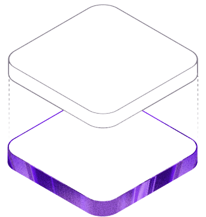

<p align="center">
  <picture>
    <source media="(prefers-color-scheme: dark)" srcset="./frontend/src/assets/ResuMatch%20logo.png">
    <source media="(prefers-color-scheme: light)" srcset="./frontend/src/assets/ResuMatch%20logo.png">
    
  </picture>
</p>

<h1 align="center">ResuMatch<span style="color:#6366f1">.ai</span></h1>

<p align="center">
  <strong>AI-Powered ATS Resume Analyzer — Smart, Fair, Recruiter-Ready</strong>
</p>

<p align="center">
  <a href="#"></a>
  <a href="#"></a>
  <a href="#"></a>
  <a href="#"></a>
  <a href="#"></a>
  <a href="#"></a>
  <a href="#"></a>
</p>

<p align="center">
  <sub><strong>All Rights Reserved.</strong> Viewing & evaluation only. See <a href="./LICENSE">LICENSE</a>.</sub>
</p>

<br>

---

<h2> Overview</h2>

<p align="center">
  <em>"ResuMatch.ai is an advanced, AI-powered ATS (Applicant Tracking System) resume analyzer SaaS platform. It eliminates recruiter bias and LLM politeness inflation by enforcing a strict mathematical scoring formula. Upload a PDF resume, specify the target role and required skills, and receive an objective, data-driven compatibility report in seconds."</em>
</p>

<br>

<h2> Core Features</h2>

<table>
  <tr>
    <td width="50%">
      <h4> Dynamic Keyword Matching</h4>
      <p>Accepts up to 12 required skills. Each keyword is checked against the resume verbatim — no inference, no hallucinations.</p>
    </td>
    <td width="50%">
      <h4> Fair Mathematical Scoring</h4>
      <p>Score = <code>(matched / total) × 10</code>. Server-side ground-truth override ensures the AI cannot inflate scores out of politeness.</p>
    </td>
  </tr>
  <tr>
    <td width="50%">
      <h4> Actionable Revision Bullets</h4>
      <p>Short, specific suggestions like <code>"Add 'Docker' to your skills section."</code> — not vague paragraphs.</p>
    </td>
    <td width="50%">
      <h4> Section-Specific Feedback</h4>
      <p>Honest, critical analysis across Skills, Experience, and Education with exact match counts.</p>
    </td>
  </tr>
  <tr>
    <td width="50%">
      <h4> Secure Data Parsing</h4>
      <p>PDF parsed in-memory via <code>pdf-parse</code>. No files stored on disk. JWT-authenticated API.</p>
    </td>
    <td width="50%">
      <h4> Multi-Provider Auth</h4>
      <p>Email/password registration + Google OAuth 2.0 with reCAPTCHA v3 spam protection.</p>
    </td>
  </tr>
</table>

<br>

---

<h2> Tech Stack</h2>

<p align="center">
  <strong>Frontend</strong>
</p>

<p align="center">
  
  
  
  
</p>

<p align="center">
  <strong>Backend & Database</strong>
</p>

<p align="center">
  
  
  
  
</p>

<p align="center">
  <strong>AI, Auth & Security</strong>
</p>

<p align="center">
  
  
  
  
  
</p>

<br>

---

<h2> UI / UX Preview</h2>

<p align="center">
  <em>Add a screenshot of your dashboard here for a premium showcase.</em>
  <br><br>
  <a href="#">
    
  </a>
  <br><br>
  <sub><code>./frontend/src/assets/hero.png</code> — Replace with your dashboard mockup for the full premium look.</sub>
</p>

<br>

---

<h2> Getting Started</h2>

<h3> Prerequisites</h3>

- <b>Node.js</b> 18+ (recommended: 20 LTS)
- <b>MongoDB Atlas</b> account (free tier works)
- <b>OpenRouter</b> API key (<a href="https://openrouter.ai/keys">get one free</a>)
- <b>Google OAuth</b> client ID (<a href="https://console.cloud.google.com/apis/credentials">create here</a>)

<h3> Installation</h3>

```bash
# 1. Clone the repository
git clone https://github.com/<your-username>/resumatch-analyzer.git
cd resumatch-analyzer

# 2. Install all dependencies (backend + frontend)
npm run install-all

# 3. Configure environment variables
cp backend/.env.example backend/.env
cp frontend/.env.example frontend/.env
```

<h3> Environment Variables</h3>

<p>Edit <code>backend/.env</code> with your credentials:</p>

```env
PORT=5000
MONGO_URI=mongodb+srv://<username>:<password>@<cluster-host>.mongodb.net/resumatch?retryWrites=true&w=majority
OPENROUTER_API_KEY=sk-or-v1-your-key-here
GEMINI_API_KEY=your-gemini-api-key
JWT_SECRET=your-random-jwt-secret
GOOGLE_CLIENT_ID=your-google-client-id
RECAPTCHA_SECRET_KEY=your-recaptcha-secret-key
```

<p>Edit <code>frontend/.env</code> with your public keys:</p>

```env
VITE_GOOGLE_CLIENT_ID=your-google-client-id
VITE_RECAPTCHA_SITE_KEY=your-recaptcha-site-key
VITE_API_URL=
```

<h3> Run Development Servers</h3>

```bash
# Start both backend & frontend concurrently
npm run dev
```

<table>
  <tr>
    <th>Service</th>
    <th>URL</th>
  </tr>
  <tr>
    <td><b>Backend API</b></td>
    <td><code>http://localhost:5000</code></td>
  </tr>
  <tr>
    <td><b>Frontend App</b></td>
    <td><code>http://localhost:5173</code></td>
  </tr>
</table>

<br>

---

<h2> Project Structure</h2>

<pre>
resumatch-analyzer/
│
├── <b>backend/</b>
│   ├── config/          # DB connection, email transporter
│   ├── controllers/     # auth, analyze, contact logic
│   ├── middleware/       # JWT authentication guard
│   ├── models/          # User, Analysis, Contact schemas
│   ├── routes/          # Express route definitions
│   └── server.js        # Entry point
│
├── <b>frontend/</b>
│   ├── public/           # Static assets (favicon, icons)
│   ├── src/
│   │   ├── assets/       # Images, logos
│   │   ├── components/   # Navbar, Footer, ProtectedRoute
│   │   ├── pages/        # Analyze, History, Login, etc.
│   │   ├── utils/        # Axios API client
│   │   ├── App.jsx
│   │   ├── main.jsx
│   │   └── index.css
│   ├── index.html
│   ├── vite.config.js
│   └── tailwind.config.js
│
├── <b>package.json</b>       # Root scripts (dev, install-all)
├── <b>.gitignore</b>
├── <b>LICENSE</b>
└── <b>README.md</b>
</pre>

<br>

---

<h2> Scoring Formula</h2>

<p align="center">
  <code><big><b>Score = (Matched Keywords / Total Required Keywords) × 10</b></big></code>
</p>

| Rule | Detail |
|------|--------|
| <b>Max Keywords</b> | Capped at 12 for accuracy & token efficiency |
| <b>Ground Truth</b> | Server re-checks each keyword against raw resume text |
| <b>AI Override</b> | If LLM inflates score, server-side cap enforces fairness |
| <b>Summary Alignment</b> | Score < 5 → <code>"Low Match"</code>, 5–7 → <code>"Moderate Match"</code>, 8+ → <code>"Strong Match"</code> |

<br>

---

<h2> License</h2>

<p>
  <strong>All Rights Reserved.</strong> Copyright © 2024–2026 Muhammad Khuzaima.
</p>
<p>
  This project is provided for <strong>viewing and evaluation</strong> purposes only.
  No permission is granted to copy, modify, distribute, or republish any portion
  of this code. See the full <a href="./LICENSE">LICENSE</a> file for details.
</p>

<br>

---

<p align="center">
  <sub>Built with ❤️ for recruiters who value fairness, transparency, and clean code.</sub>
  <br>
  <sub>ResuMatch.ai — <b>Your Resume. Matched. Fairly.</b></sub>
</p>
